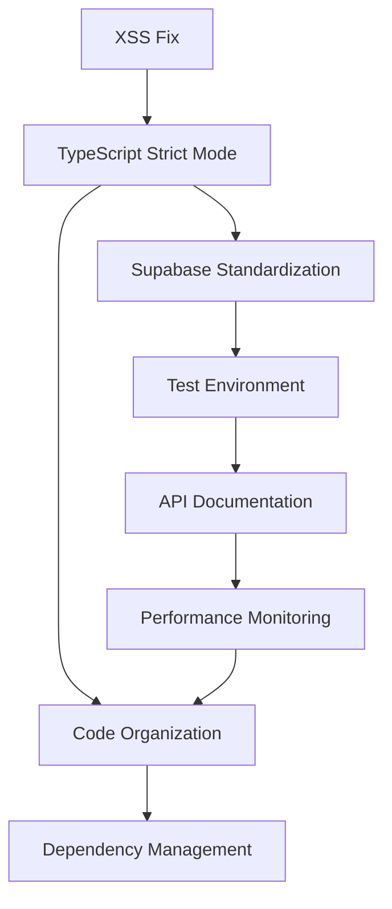

# 🚀 Astro Maskom: Actionable Task List

## 📋 Executive Summary

Based on comprehensive repository analysis, here are the prioritized, actionable tasks to improve the Astro Maskom codebase. Tasks are organized by priority and include specific implementation details.

---

## 🔴 **CRITICAL PRIORITY (Fix Within 24-48 Hours)**

### **Task 1: Fix XSS Vulnerability in Chatbot**
**Issue**: #348 | **Estimated Time**: 4-6 hours | **Assignee**: Security Team

#### **Immediate Actions:**
1. **Replace innerHTML usage** in `src/scripts/chatbot.js:20`
   ```javascript
   // Current (vulnerable):
   element.innerHTML = userInput;
   
   // Fixed (secure):
   element.textContent = userInput;
   // OR with sanitization:
   import DOMPurify from 'dompurify';
   element.innerHTML = DOMPurify.sanitize(userInput);
   ```

2. **Install DOMPurify dependency**
   ```bash
   npm install dompurify @types/dompurify
   ```

3. **Update CSP headers** in `src/middleware/security.ts`
4. **Security test** the chatbot functionality

#### **Validation:**
- [ ] XSS penetration testing passes
- [ ] Chatbot functionality preserved
- [ ] No console errors
- [ ] Security scan clean

---

### **Task 2: Enable TypeScript Strict Mode**
**Issue**: #347 | **Estimated Time**: 8-12 hours | **Assignee**: TypeScript Team

#### **Phase 1: Configuration**
1. **Update tsconfig.json**
   ```json
   {
     "compilerOptions": {
       "strict": true,
       "noUnusedLocals": true,
       "noUnusedParameters": true
     }
   }
   ```

2. **Run TypeScript compiler** to identify all errors
   ```bash
   npm run typecheck
   ```

#### **Phase 2: Fix Critical Type Issues**
1. **src/types/api.d.ts:5** - Replace `validatedData?: any`
2. **src/pages/api/invoices/download.ts** - Type `generateInvoiceHTML` parameter
3. **src/pages/api/bandwidth/admin/monitoring.ts** - Fix `(profile as any)` casting
4. **src/pages/api/health.ts** - Fix `(globalThis as any)` casting
5. **src/lib/status.ts** - Fix `(supabase as any)` casting

#### **Validation:**
- [ ] All TypeScript errors resolved
- [ ] Build passes successfully
- [ ] No runtime type errors
- [ ] All tests pass

---

## 🟠 **HIGH PRIORITY (Fix Within 1 Week)**

### **Task 3: Standardize Supabase Client Usage**
**Issue**: #349 | **Estimated Time**: 12-16 hours | **Assignee**: Backend Team

#### **Step 1: Create Client Factory**
```typescript
// src/lib/supabase-client-factory.ts
export class SupabaseClientFactory {
  private static instances = new Map<string, any>();
  
  static getClient(type: 'client' | 'server' | 'service' = 'client') {
    if (!this.instances.has(type)) {
      this.instances.set(type, this.createClient(type));
    }
    return this.instances.get(type);
  }
  
  private static createClient(type: string) {
    // Implementation based on type
  }
}
```

#### **Step 2: Migrate Files (Priority Order)**
1. **API Routes** (highest priority)
2. **Email Services**
3. **Security Modules**
4. **Payment Services**
5. **Status Services**

#### **Step 3: Update Imports**
```bash
# Find all files to update
grep -r "createClient" src/ --include="*.ts" --include="*.js"
```

#### **Validation:**
- [ ] All files use factory pattern
- [ ] No direct Supabase imports
- [ ] Consistent error handling
- [ ] Performance tests pass

---

### **Task 4: Fix Test Environment**
**Issue**: #350 | **Estimated Time**: 8-10 hours | **Assignee**: QA Team

#### **Step 1: Environment Setup**
1. **Verify vitest installation**
   ```bash
   npm install --save-dev vitest @vitest/ui @vitest/coverage-v8
   ```

2. **Update vitest.config.ts**
   ```typescript
   export default defineConfig({
     test: {
       coverage: {
         thresholds: {
           global: { branches: 85, functions: 85, lines: 85, statements: 85 }
         },
         exclude: [
           'node_modules/',
           'dist/',
           '**/*.d.ts',
           'src/test/',
           '**/*.config.*'
         ]
       }
     }
   });
   ```

#### **Step 2: Add Critical Tests**
1. **API Endpoint Tests** (all `/api/*` routes)
2. **Security Module Tests**
3. **Supabase Client Tests**
4. **Error Handling Tests**

#### **Step 3: CI/CD Integration**
```yaml
# Add to .github/workflows/ci.yml
- name: Run Tests
  run: npm run test:coverage
- name: Upload Coverage
  uses: codecov/codecov-action@v3
```

#### **Validation:**
- [ ] Test suite runs successfully
- [ ] 85%+ coverage achieved
- [ ] All API endpoints tested
- [ ] CI pipeline passes

---

## 🟡 **MEDIUM PRIORITY (Fix Within 2 Weeks)**

### **Task 5: Create API Documentation**
**Issue**: #351 | **Estimated Time**: 10-12 hours | **Assignee**: Documentation Team

#### **Step 1: API Discovery**
```bash
# List all API endpoints
find src/pages/api -name "*.ts" | head -20
```

#### **Step 2: Create OpenAPI Spec**
```yaml
# docs/api/openapi.yaml
openapi: 3.0.0
info:
  title: Maskom Network API
  version: 1.0.0
paths:
  /api/health:
    get:
      summary: Health check endpoint
      responses:
        '200':
          description: OK
```

#### **Step 3: Generate Documentation**
1. **Install swagger-ui**
2. **Create documentation pages**
3. **Add code examples**
4. **Set up interactive docs**

#### **Validation:**
- [ ] All endpoints documented
- [ ] OpenAPI spec validates
- [ ] Interactive docs working
- [ ] Examples tested

---

### **Task 6: Performance Monitoring**
**Issue**: #304 | **Estimated Time**: 6-8 hours | **Assignee**: DevOps Team

#### **Step 1: Bundle Analysis**
```bash
npm install --save-dev @rollup/plugin-analyzer
npm run build -- --analyze
```

#### **Step 2: Performance Metrics**
1. **Add Web Vitals monitoring**
2. **Implement error tracking**
3. **Set up performance dashboards**
4. **Create performance budgets**

#### **Validation:**
- [ ] Bundle size optimized
- [ ] Performance metrics collected
- [ ] Dashboards functional
- [ ] Alerts configured

---

## 🟢 **LOW PRIORITY (Fix Within 1 Month)**

### **Task 7: Code Organization**
**Estimated Time**: 4-6 hours | **Assignee**: Development Team

#### **Actions:**
1. **Standardize file naming** (kebab-case)
2. **Group related files** in folders
3. **Remove unused imports**
4. **Consolidate duplicate code**

#### **Validation:**
- [ ] Consistent naming convention
- [ ] Logical folder structure
- [ ] No unused imports
- [ ] Reduced code duplication

---

### **Task 8: Dependency Management**
**Estimated Time**: 2-4 hours | **Assignee**: Development Team

#### **Actions:**
1. **Update outdated dependencies**
   ```bash
   npm outdated
   npm update
   ```

2. **Remove unused dependencies**
3. **Audit security vulnerabilities**
   ```bash
   npm audit fix
   ```

#### **Validation:**
- [ ] All dependencies up to date
- [ ] No security vulnerabilities
- [ ] No unused dependencies
- [ ] Build successful

---

## 📊 **Task Dependencies**



---

## 🎯 **Success Metrics**

### **Quality Metrics**
- **TypeScript Errors**: 0
- **Test Coverage**: 85%+
- **Security Vulnerabilities**: 0
- **Bundle Size**: < 1MB

### **Performance Metrics**
- **Page Load**: < 2 seconds
- **Time to Interactive**: < 3 seconds
- **API Response**: < 500ms
- **Build Time**: < 2 minutes

### **Development Metrics**
- **PR Merge Time**: < 24 hours
- **Issue Resolution**: < 72 hours
- **Test Run Time**: < 5 minutes
- **Documentation Coverage**: 100%

---

## 📅 **Weekly Sprint Plan**

### **Week 1: Critical Fixes**
- **Monday**: XSS vulnerability fix
- **Tuesday**: TypeScript strict mode (Phase 1)
- **Wednesday**: TypeScript strict mode (Phase 2)
- **Thursday**: Security testing and validation
- **Friday**: Code review and deployment

### **Week 2: Architecture**
- **Monday**: Supabase client factory
- **Tuesday**: Migrate API routes
- **Wednesday**: Migrate services
- **Thursday**: Testing and validation
- **Friday**: Documentation updates

### **Week 3: Testing & Documentation**
- **Monday**: Test environment setup
- **Tuesday**: API endpoint tests
- **Wednesday**: Coverage improvements
- **Thursday**: API documentation
- **Friday**: Integration testing

### **Week 4: Performance & Polish**
- **Monday**: Performance monitoring
- **Tuesday**: Bundle optimization
- **Wednesday**: Code organization
- **Thursday**: Dependency updates
- **Friday**: Final testing and deployment

---

## 🚨 **Risk Mitigation**

### **High-Risk Tasks**
1. **TypeScript Strict Mode**: May break existing functionality
   - **Mitigation**: Incremental rollout, extensive testing
   
2. **Supabase Refactoring**: May affect database operations
   - **Mitigation**: Feature flags, rollback plan

### **Medium-Risk Tasks**
1. **Test Environment**: May delay development
   - **Mitigation**: Parallel development, minimal disruption

2. **API Documentation**: May become outdated
   - **Mitigation**: Automated documentation generation

---

## 📞 **Contact Information**

### **Team Assignments**
- **Security Team**: XSS vulnerability, CSP headers
- **TypeScript Team**: Type safety, strict mode
- **Backend Team**: Supabase, API endpoints
- **QA Team**: Testing, coverage, validation
- **Documentation Team**: API docs, user guides
- **DevOps Team**: Performance, monitoring, CI/CD

### **Escalation Path**
1. **Blockers**: Immediate escalation to tech lead
2. **Delays**: Communicate in daily standup
3. **Quality Issues**: Raise in PR review
4. **Security Concerns**: Report to security team immediately

---

**Last Updated**: 2025-11-20
**Next Review**: 2025-11-27
**Document Owner**: Project Manager
**Review Frequency**: Weekly